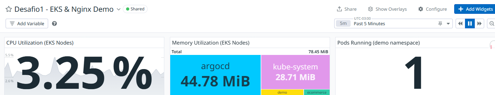

# Observabilidade

Para garantir visibilidade e confiabilidade do ambiente Kubernetes (EKS) e da aplicação Nginx Demo, foi implementado um dashboard Datadog customizado, focado nos principais indicadores de saúde e performance do cluster e dos workloads.

## Dashboard Datadog: "Desafio1 - EKS & Nginx Demo"

O dashboard foi criado para fornecer uma visão centralizada e em tempo real dos seguintes aspectos:

- **CPU Utilization (EKS Nodes):**
  Exibe o uso médio de CPU dos nodes do cluster EKS, permitindo identificar rapidamente sobrecarga ou subutilização de recursos.

- **Memory Utilization (EKS Nodes):**
  Apresenta o consumo de memória por namespace, facilitando a análise de uso e a detecção de possíveis vazamentos ou gargalos.

- **Pods Running (demo namespace):**
  Mostra a quantidade de pods em execução no namespace de interesse, com destaque visual para situações fora do esperado, permitindo rápida identificação de falhas de disponibilidade.

### Benefícios

- **Monitoramento proativo:** Permite detectar anomalias e agir antes que impactem o usuário final.
- **Visão centralizada:** Todos os principais indicadores do cluster e da aplicação em um único painel.
- **Aderência a SRE:** Métricas essenciais para SLI/SLO, facilitando a gestão de confiabilidade.

### Como acessar

O dashboard pode ser acessado diretamente na interface do Datadog, na seção de Dashboards, sob o nome:
**Desafio1 - EKS & Nginx Demo**

## Dashboard criado como exemplo para demonstrar a coleta dos dados do EKS

- **Datadog/Grafana** com:
    - Healthcheck dos componentes do cluster
    - Latência e disponibilidade da aplicação
    - Uso de CPU/Memória/pods
    
## Benefícios

- **Visibilidade fim-a-fim**
- **Detecção proativa de incidentes**
- **Base para melhoria contínua dos SLOs**
